# String Translator Desktop App

## Overview

String Translator Desktop App is a simple desktop application designed to help developers translate strings easily. It supports the translation of multiple strings into various languages, making the localization process more efficient.

## Features

- **Bulk Translation**: Translate multiple strings at once to target languages.
- **Language Selection**: Choose from a variety of supported languages for translation.
- **User-Friendly Interface**: Intuitive and easy-to-use graphical interface.
- **Export to XML Format**: Export translated strings to XML for seamless integration into your projects.

## Getting Started

### How to Build and Run the App 🛠️

1. Clone the repository: `https://github.com/Coding-Meet/String-Translator-App.git`
2. Navigate to the project directory: `cd String-Translator-App`
3. Build the project: `./gradlew build`
4. Run the application: `./gradlew run`

## Working 💻

1. **Launch the application.**

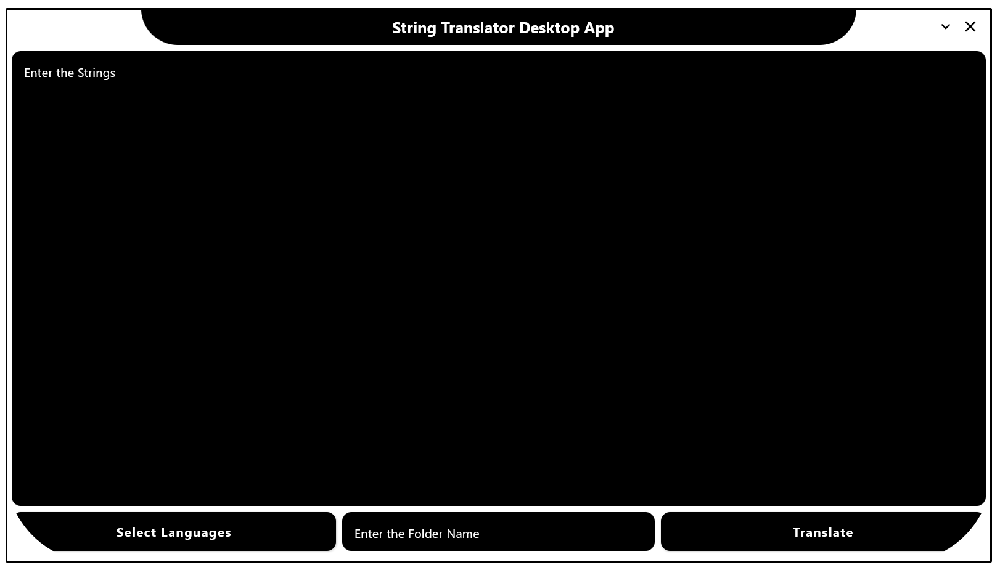

2. **Enter the source strings in XML format into the provided text field.**

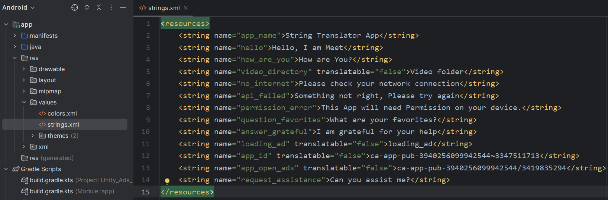
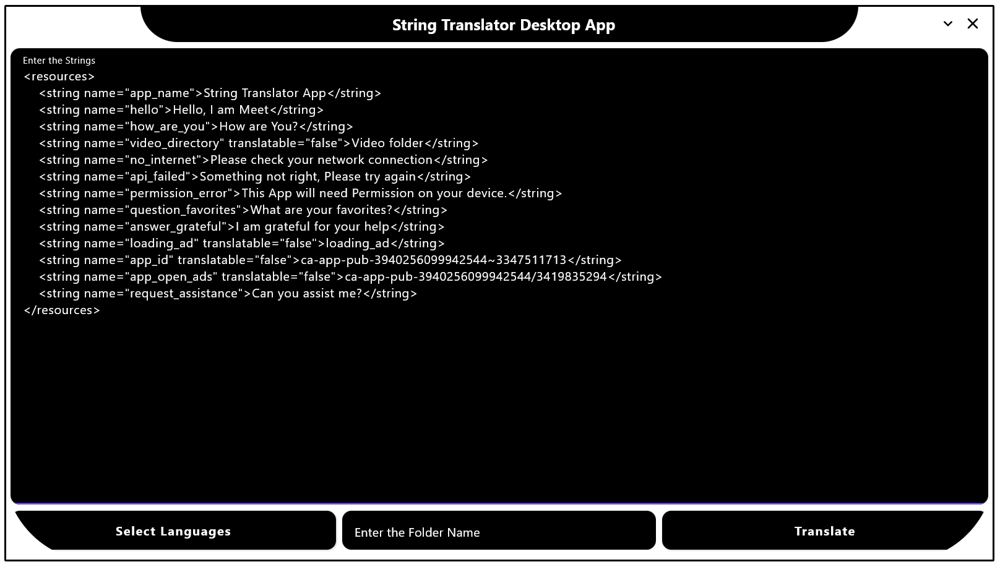

3. **Select the target languages.**

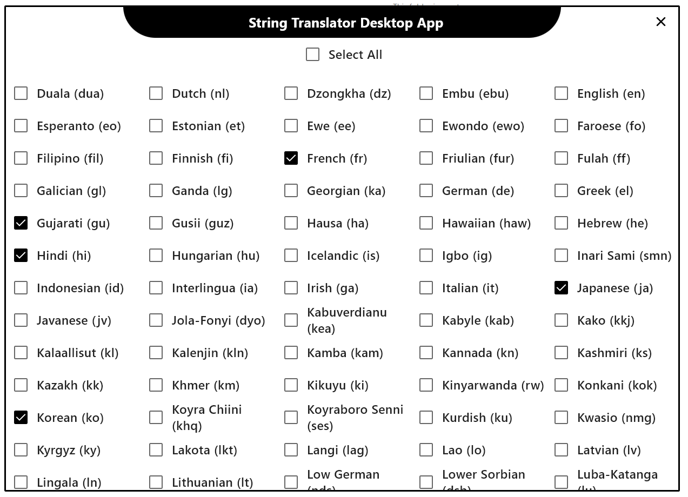

4. **Enter the folder name where you want to store the translated strings.**

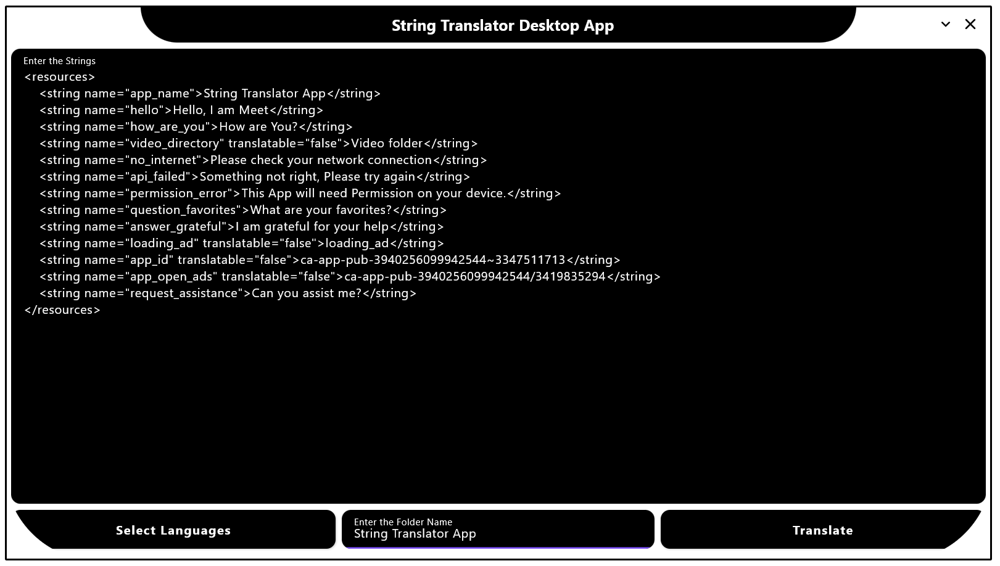

5. **Click "Translate" to initiate the translation process.**

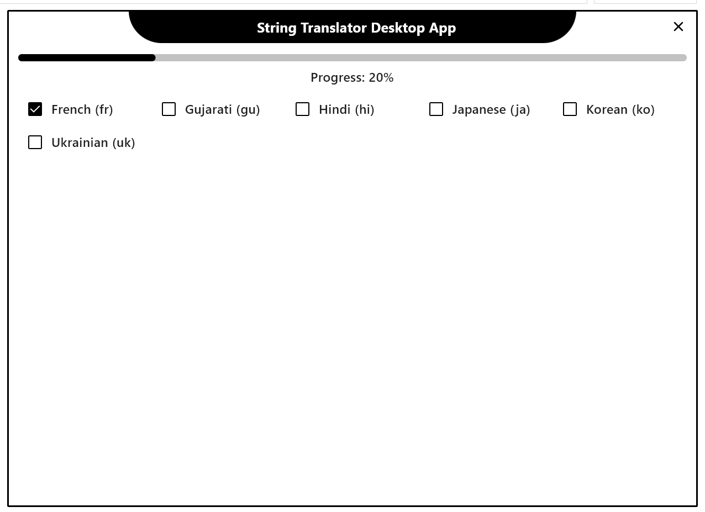

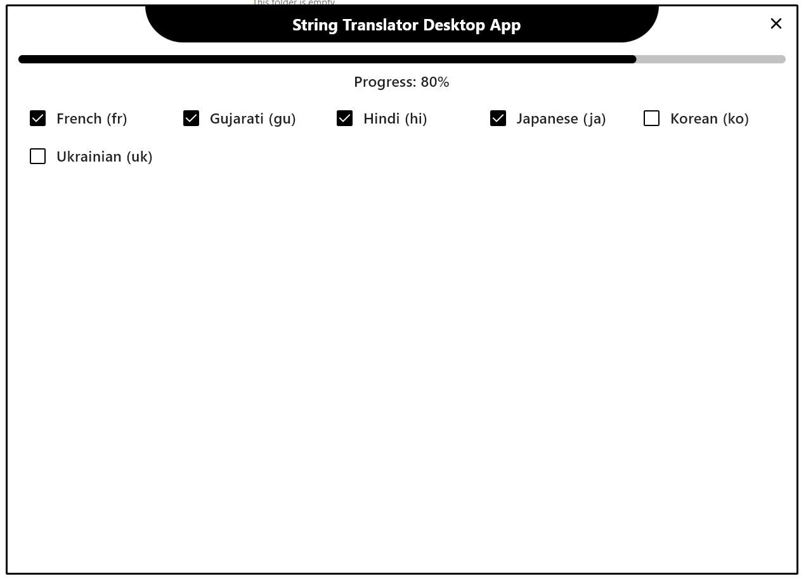

6. **Click "Done".**

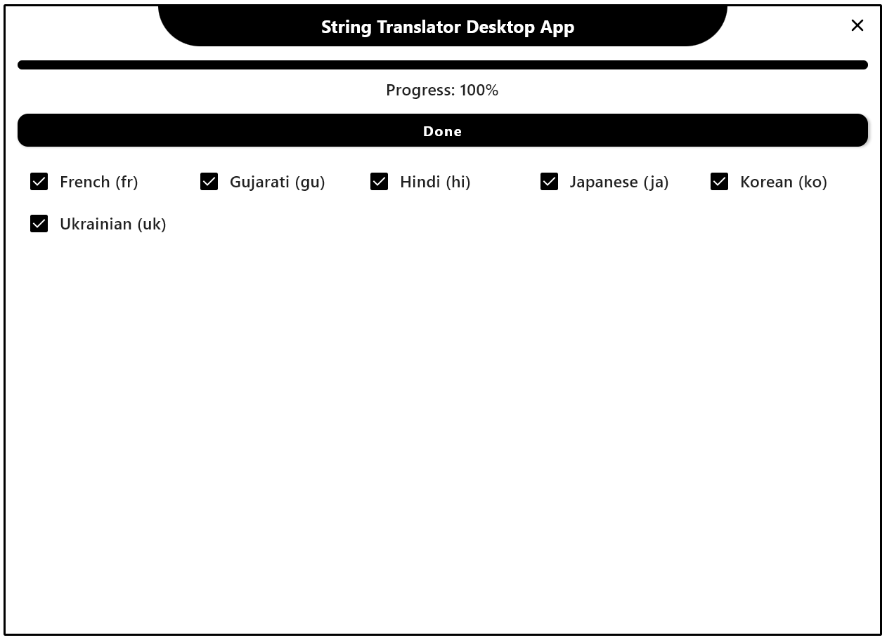

7. **"All strings have been successfully translated" message shown.**

8. **The translated strings in XML format will be saved in the output folder within your specified folder Name.**

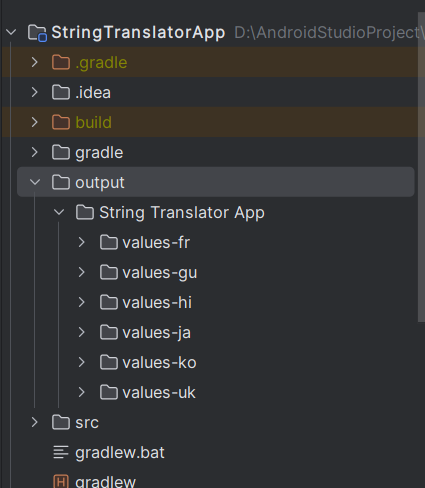

9. **Open Android Studio Project and paste all values folder in an Src Folder using Explorer.**

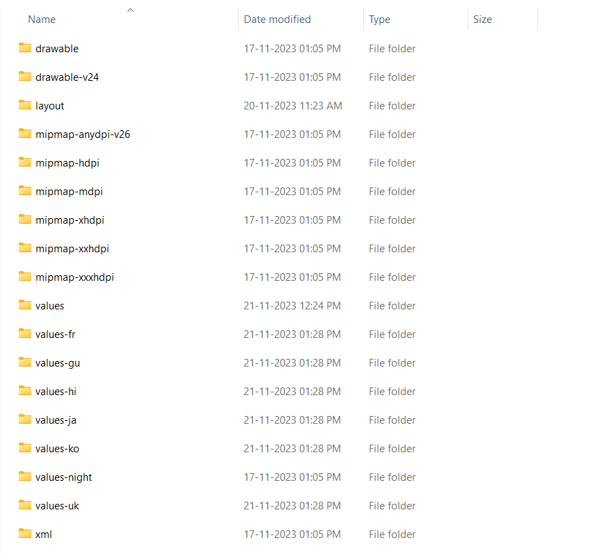

10. **All translated strings successfully imported.**

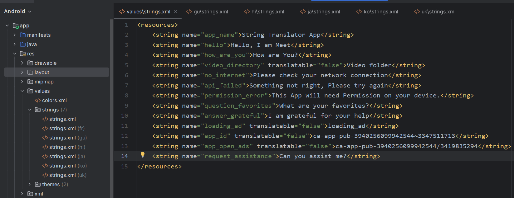
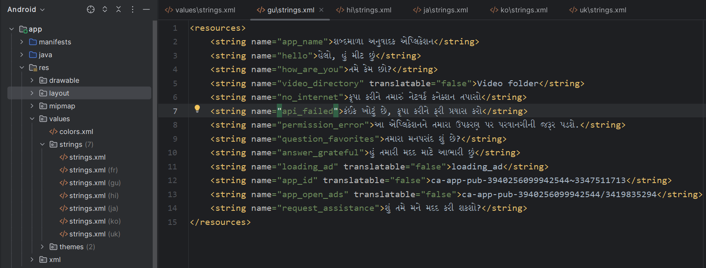
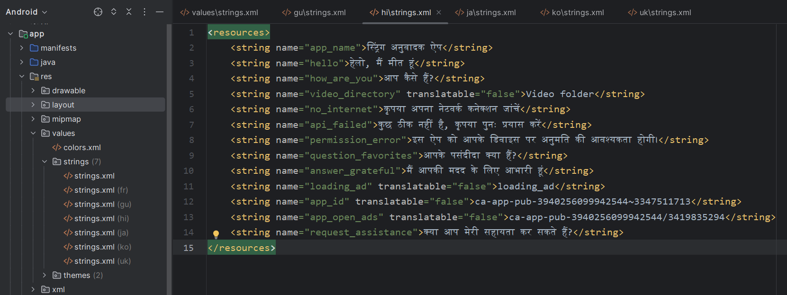

## Contributing 🤝

Join us in shaping the future of this project – your contributions are invaluable!

1. **Fork the repository** and create a new branch for your feature or bug fix.
2. Select an existing issue or create a new one, and request that it be assigned.
3. If the issue is assigned, make your changes and ensure that the code follows the project's coding standards.
4. Write tests to cover your changes and ensure that existing tests pass.
5. Submit a **pull request**, explaining the changes and the problem it addresses.
6. A project maintainer will review your pull request. Please be patient during the review process.
7. Upon approval, your changes will be merged into the main branch.
Thank you for your contribution! 🚀

## Author

**Meet**

If you appreciate my work, consider following me on LinkedIn, YouTube, and adding this project to your favorites on GitHub. Stay tuned for more insights into app development, Kotlin, and more!

## License

MIT License

Copyright (c) 2023 Meet

Permission is hereby granted, free of charge, to any person obtaining a copy
of this software and associated documentation files (the "Software"), to deal
in the Software without restriction, including without limitation the rights
to use, copy, modify, merge, publish, distribute, sublicense, and/or sell
copies of the Software, and to permit persons to whom the Software is
furnished to do so, subject to the following conditions:

The above copyright notice and this permission notice shall be included in all
copies or substantial portions of the Software.

THE SOFTWARE IS PROVIDED "AS IS", WITHOUT WARRANTY OF ANY KIND, EXPRESS OR
IMPLIED, INCLUDING BUT NOT LIMITED TO THE WARRANTIES OF MERCHANTABILITY,
FITNESS FOR A PARTICULAR PURPOSE AND NONINFRINGEMENT. IN NO EVENT SHALL THE
AUTHORS OR COPYRIGHT HOLDERS BE LIABLE FOR ANY CLAIM, DAMAGES OR OTHER
LIABILITY, WHETHER IN AN ACTION OF CONTRACT, TORT OR OTHERWISE, ARISING FROM,
OUT OF OR IN CONNECTION WITH THE SOFTWARE OR THE USE OR OTHER DEALINGS IN THE
SOFTWARE.
